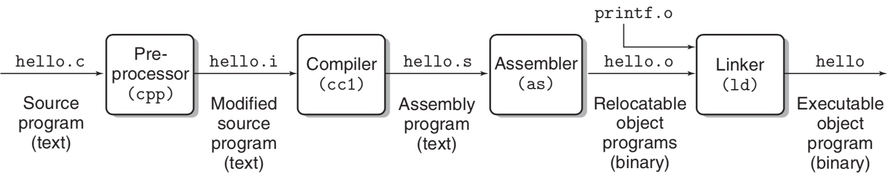

# 中文乱码问题总结
最近在实现项目时，需要调用windows的MessageBox接口弹出对话框，当传入字符串是中文时，对话框显示乱码。将文件格式另存为utf-8 with bom或者gb2312就可以正常显示，后来花时间研究了编码的问题，大概摸清楚了。
## 乱码原因
程序出现乱码的本质原因是用错误的字符集去解析字符。计算机运行的程序里，程序中的每个字符都会被转换为二进制，不同的字符集就是将字符到二进制的不同映射方式。

## 字符集

| 字符集 | 年份 | 兼容性 | 编码形式 | 备注 |
| --- | --- | --- | --- | --- |
| ASCII | 1967 |  | 使用单字节，可表示256个字符 | 美国标准，不能满足其他国家甚至其他英语国家，如￡ |
| GB2312/GB2312-80 | 1981.5.1 | ASCII | 任意字符都采用2字节 | 简化字汉字，以及一般常用字母和符号。对于人名、古汉语等方面出现的罕用字无法表示 |
| GBK | 1995.12 | ASCII,GB2312 | 任意字符都采用2字节 | 加入对繁体字支持 |
| Unicode | 1984.4 |  | 定长2字节/4字节编码 | 定长编码便于计算机处理。可表示所有字符，java内部使用unicode |
| utf-8 |  | 兼容ASCII | 变长1-6字节。一般英文1字节，中文3字节 |  |

## 字符集与程序的关系
先从程序的执行流程开始谈起，下图是一个文件从编写到编译到执行的过程。

在这个过程中存在三种字符集概念：
1. 源码字符集：源程序代码编码字符集，可以通过vscode、notepad++等文本编辑工具查看某个文件的编码字符集，该编码字符集就是源码字符集。源码字符集主要决定源代码转换成字节码的方式。所以，如果代码文件中包含中文字符，那么源码字符集将决定该字符转换后的字节码。
2. 执行字符集：执行字符集是程序编译器编译程序时采用的字符集。由上图可以看到，源代码文件经过编译器后生成.s后缀的汇编程序文件，执行字符集决定如何将转换成字节码的代码文件再次解释、检查语法、生成汇编语言。如果执行字符集与源码字符集不相同，会造成中文乱码，甚至会出现奇怪的编译错误。
3. 解析字符集：程序执行时需要显示原字符时采用的解析字符集，比如在控制台显示程序中的字符串，会通过解析字符集找到特定的字符进行显示。

### 字符集默认值
***locale***: windows系统中的一项**系统设置**，用来决定文件编码方式，对于中国大陆，locale是Chinese PRC，则此时ANSI编码为GBK。可以理解为系统默认的编码方式。
- 执行字符集：在编译器无法识别源代码使用何种字符集时采用locale。
- 解析字符集：在默认情况下是根据locale设置的，即GBK编码。

## 乱码案例重现
```c++
const char* test = "啊啊";
```
源文件采用utf-8编码，上述代码的字符串会被编码为E5958A;E5958A，使用GBK编码解析时解析为*鍟婂晩*，这就是乱码产生的原因。如果只有一个*啊*的话会出现编译错误，因为GBK编码是定长2字节，解析*啊*时会把最后一字节与后面的分号编码的字节组成新的GBK字符。

## 解决方案
乱码问题本质上就是源代码字符集与执行字符集和解析字符集不同产生，解决方案就是修改前者或后者。
1. 修改源代码字符集：可以将源代码字符集修改成与执行字符集相同的GBK编码或者utf-8 with  bom。utf-8 with bom可行的原因在于该编码方式会在编码起点加上0xef,0xbb,0xbf三个字节的bom头，编译器通过bom头可以判断源代码使用utf-8进行编码，不会根据locale选择编码方式。缺点是无法在大型项目进行代码共享，因为utf-8在网站、论坛使用更广泛。
2. 修改执行字符集与解析字符集：对于visual studio，添加命令/utf-8进行设置。

## 相关链接
[检查乱码](http://www.mytju.com/classcode/tools/messyCodeRecover.asp)